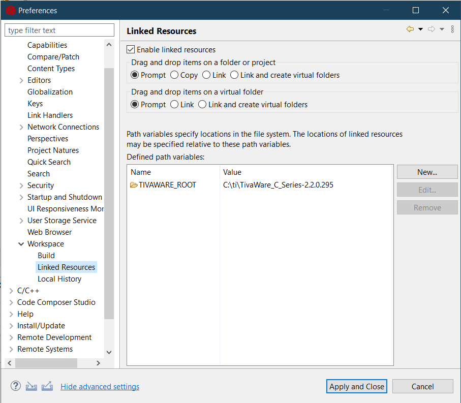

# TivaWare Graphics Driver for the Nokia 5110 LCD

## Intro
A library for hooking up the [Nokia 5110](https://en.wikipedia.org/wiki/Nokia_5110) LCD
to the [TivaWare](https://www.ti.com/tool/SW-TM4C) graphics library
for the Texas Instruments TM4C [Arm Cortex-M4F](https://en.wikipedia.org/wiki/ARM_Cortex-M) device family.

This wraps the Nokia 5110 LCD driver found in this page: https://users.ece.utexas.edu/~valvano/arm/Nokia5110_4C123.zip

The TivaWare graphics library provides drawing primitives, text rendering, widgets, and more.

## How to use

First, see [Nokia5110.h](lib/Nokia5110.h) for details on how you should connect your pins.

The [lib](libs/) directory contains the Nokia 5110 TivaWare graphics driver files along with the display driver files taken from the page above.

To use, include the `Nokia5110_graphics.h` header file and pass a pointer to the `Nokia5110_driver` tDisplay variable
provided by the header to the TivaWare's `GrContextInit` function. You also need to call the `Nokia5110_Init` function exported from `Nokia5110.h`:

```c
tContext context;
Nokia5110_Init();
GrContextInit(&context, &Nokia5110_driver);
```

## Demos

The [demo](demo/) directory contains some simple example [Code Composer Studio](https://www.ti.com/tool/CCSTUDIO) projects.
Those were only tested for the TM4C123GXL launchpad in CCS, but they should work for any Tiva C series device,
maybe after replacing the auto-generated startup code (`tm4c123gh6pm_startup_ccs.c`) and target configurations (`Tiva TM4C123GH6PM.ccxml`).

You need to set up a path variable named `TIVAWARE_ROOT` pointing to the location of the TivaWare library on your system for the demo projects to build in CCS.



## TODO

I intend to add more demos as I learn more about the launchpad and TivaWare.

## References

- [TivaWare Graphics Library User's Guide](https://www.ti.com/lit/pdf/SPMU300E)
