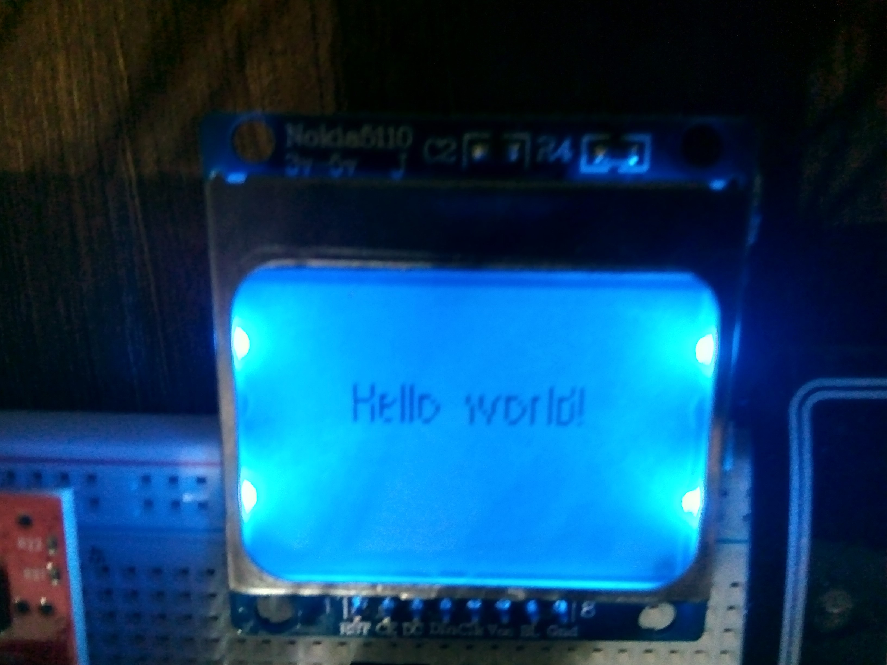
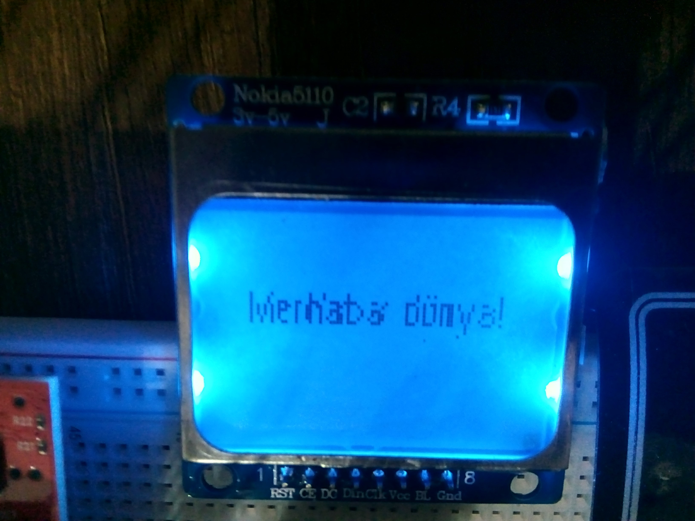

# text-demo

This project demonstrates multilingual text rendering.

It uses the [Noto Sans](https://www.google.com/get/noto/#sans-lgc) font to display English and Turkish text.

The font was converted to a format TivaWare can understand using the ftrasterize tool found under tools/ in the TivaWare library directory
using the following command:
```
./ftrasterize -f notosans -s 10 -r -e 400 NotoSans-Regular.ttf
```

## TODO
- Right-to-left text rendering? this requires some work. See the docs.

## Images



